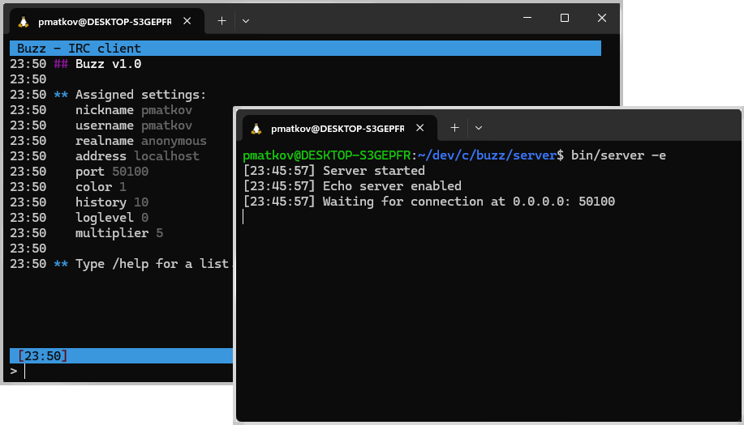

## IRC client and server

These are IRC client and server apps written in C

**Background**

IRC was once a popular protocol for online chat. Compared to modern protocols, it is relatively simple, offering only real-time text messaging in its basic version. This simplicity and widespread use were the main reasons I chose IRC for my final thesis project.

To demonstrate online chat in an IRC network, I developed an IRC client and server. These are not fully featured IRC applications, as implementing all features would be too time-consuming. However, they support a limited set of IRC rules, sufficient to showcase the basic principles of online chat.

The goal was to create a simple yet functional IRC network using a single server (IRC also supports multi-server networks) capable of handling up to 1,000 clients.

The applications were developed in C for Linux, utilizing several libraries. The client features a text-based UI, implemented with the *ncurses* library. Unit testing was performed using the *Check* library. Network communication was tested directly between the client and server, as well as through shell scripts. Additionally, a custom library of data structures and functions was created.

Both the client and server use event-driven programming and I/O multiplexing to efficiently handle network communication.

**Client features**

- text based UI with multiple windows
- basic line editing (del, bs, home, end, left/ right arrow keys)
- command history (up/down arrow keys)
- scrollback buffer for overflowing text (pgup, pgdown or ctrl + up/down arrow keys)
- command parsing and execution
- display of command responses and server messages
- supports IRC commands such as *NICK*, *JOIN*, *PART* and *PRIVMSG*, etc.
- command line args for start-up configuration and in-app settings

**Server features**

- handles up to 1000 clients simultaneously
- echo server mode (for testing network communication)
- daemon mode (runs as a background process)
- accepts client connections
- command parsing and execution
- sends responses or forwards messages to IRC clients
- command line arguments for startup configuration

**Compiling and testing**
- to compile the binaries run `make` in the *client*, *server* and *libs* directories
- to run unit tests use `make test`

**Instructions:**
- client commands start with `/`; for example, to list available commands use `/help`
- server may be started in echo mode with `-e` and run as a daemon with `-d` flag
  